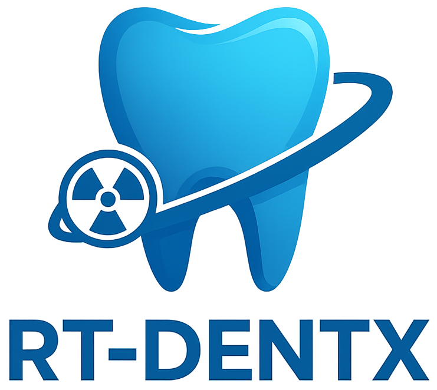

<div align="center">
  
  
  # RT-DENTX : DENTal eXposure in Radiation Therapy
  
  **Logiciel de relevé dosimétrique dentaire pour la radiothérapie**
  
  
  
  
  
  © 2025 Caroline Moreau-Noblet — Licence BSD 3-Clause
</div>

---
## Description

RT-DENTX est un logiciel destiné à l'évaluation de la dose reçue par les structures dentaires lors de traitements de radiothérapie de la tête et du cou. Il permet aux professionnels de santé d'identifier précisément les dents à risque d'ostéoradionécrose et de générer des rapports dosimétriques détaillés.

### Fonctionnalités principales

- 📊 **Analyse DICOM** : Chargement et visualisation de fichiers DICOM (CT, RTDose, RTStruct)
- 🎯 **Segmentation dentaire** : Identification des structures dentaires
- 📈 **Calcul dosimétrique** : Évaluation de la dose reçue par chaque dent
- 🎨 **Cartographie visuelle** : Visualisation 3D avec code couleur selon les niveaux de risque
- 📄 **Rapports PDF** : Génération automatique de rapports cliniques détaillés
- ⚡ **Interface intuitive** : Conçue pour une utilisation clinique rapide
- 🔧 **Configuration personnalisable** : Ajustement des seuils de risque et paramètres d'affichage
- 💾 **Export RTStruct** : Intégration des structures dentaires dans les fichiers DICOM


## Installation

### Prérequis

- Python 3.8 ou supérieur
- Windows 10/11, macOS 10.14+, ou Linux (Ubuntu 20.04+)
- 4 GB de RAM minimum (8 GB recommandé)
- Résolution d'écran 1600x900 minimum

### Installation depuis les sources

1. **Cloner le repository**
```bash
git clone https://github.com/CNPhysMed/RT-DENTX.git
cd RT-DENTX
```

2. **Créer un environnement virtuel**
```bash
python -m venv venv
# Windows
venv\Scripts\activate
# macOS/Linux
source venv/bin/activate
```

3. **Installer les dépendances**
```bash
pip install -r requirements.txt
```

4. **Lancer l'application**
```bash
python main.py
# Note: instant_splash_launcher.py est uniquement pour créer l'exécutable Windows
```

### Installation de l'exécutable Windows

Des versions précompilées sont disponibles dans la section [Releases](https://github.com/votre-username/RT-DENTX/releases) :
- **Windows** : RT-DENTX.exe et RT-DENTX-Core.exe (à placer dans le même dossier)


## Utilisation

### Démarrage rapide

1. **Lancer RT-DENTX**
2. **Charger les données DICOM** : File → Open DICOM Folder
3. **Placer les points de référence** : Cliquer sur les 6 dents de référence (11, 13, 18, 41, 43, 48)
4. **Générer automatiquement les autres dents** : Bouton "Générer autres dents"
5. **Générer les cylindres 3D** : Bouton "Générer cylindres 3D"
6. **Créer le rapport** : Bouton "📊 Générer rapport dosimétrique"

### Workflow clinique recommandé

1. **Préparation des données**
   - Assurez-vous d'avoir les fichiers DICOM complets (CT + RTDose + RTStruct)
   - Vérifiez que le plan de traitement est finalisé

2. **Placement des structures dentaires**
   - Placez manuellement les 6 points de référence dentaires
   - Laissez l'algorithme générer automatiquement les autres positions
   - Ajustez manuellement si nécessaire en mode édition

3. **Analyse dosimétrique**
   - Générez les cylindres 3D représentant les dents
   - Visualisez la distribution de dose avec les codes couleur
   - Ajustez les seuils de risque si nécessaire (30 Gy et 50 Gy par défaut)

4. **Génération du rapport**
   - Vérifiez les doses calculées dans l'aperçu
   - Personnalisez les recommandations cliniques si besoin
   - Exportez en PDF pour le dossier patient

## Configuration

### Personnalisation des seuils de dose

Les recommandations cliniques et les seuils de risque peuvent être modifiés via le menu Configuration :
- **Risque faible** : < 30 Gy (par défaut)
- **Risque modéré** : 30-50 Gy
- **Risque élevé** : > 50 Gy

### Paramètres dentaires

Chaque dent peut être configurée individuellement :
- Hauteur de couronne et de racine
- Diamètre
- Inclinaison
- Position 3D

# Structure complète des fichiers RT-DENTX

```
RT-DENTX/
│
├── 📄 main.py                          # Point d'entrée principal
│                                       # - Initialise l'application
│                                       # - Lance DicomViewer
│                                       # - Gère les arguments ligne de commande
│
├── 📄 dicom_viewer_main.py             # Interface principale et application
│                                       # - Classe DicomViewer (hérite de tk.Tk)
│                                       # - Gestion de l'affichage CT/dose/contours
│                                       # - Navigation dans les coupes
│                                       # - Coordination des modules
│
├── 📄 dicom_loader.py                  # Chargement des fichiers DICOM
│                                       # - load_ct_series()
│                                       # - load_rtstruct()
│                                       # - load_rtdose()
│                                       # - Validation et tri des fichiers
│
├── 📄 tooth_generator.py               # Génération automatique des dents
│                                       # - Classe ToothGenerator
│                                       # - generate_all_teeth()
│                                       # - Calcul positions par interpolation
│                                       # - Configuration anatomique par défaut
│
├── 📄 tooth_reference_editor.py        # Éditeur de points de référence
│                                       # - Classe ToothReferenceEditor
│                                       # - Mode placement et édition
│                                       # - Gestion interactive des points
│                                       # - Sélection multiple et déplacement
│
├── 📄 dose_report_generator.py         # Générateur de rapports dosimétriques
│                                       # - Classe DoseReportGenerator
│                                       # - Interface graphique du générateur
│                                       # - Calcul des doses par structure
│                                       # - Évaluation des risques
│
├── 📄 rapport_pdf_enhanced.py          # Génération PDF des rapports
│                                       # - create_enhanced_dose_report()
│                                       # - Création des cartographies visuelles
│                                       # - Tableaux de doses avec code couleur
│                                       # - Recommandations cliniques
│
├── 📄 plan_info_enhanced.py            # Extraction infos plan de traitement
│                                       # - extract_plan_info()
│                                       # - Récupération des métadonnées RTDose
│                                       # - Informations patient et traitement
│                                       # - Statistiques du plan
│
├── 📄 config_manager.py                # Gestion de la configuration
│                                       # - Classe ConfigManager
│                                       # - Paramètres dentaires par défaut
│                                       # - Seuils de risque configurables
│                                       # - Sauvegarde/chargement config JSON
│
├── 📄 ui_panels.py                     # Panneaux d'interface utilisateur
│                                       # - ToothPanel : outils dentaires
│                                       # - DosePanel : contrôles d'affichage dose
│                                       # - ToothConfigDialog : édition paramètres
│                                       # - NavigationPanel : navigation coupes
│
├── 📄 improved_about_dialogs.py        # Dialogues À propos et licences
│                                       # - SplashScreen : écran de démarrage
│                                       # - LicenseDialog : acceptation licence
│                                       # - AboutDialog : informations application
│                                       # - SourcesDialog : références scientifiques
│
├── 📄 integration_simple.py            # Intégration bouton rapport
│                                       # - add_dose_report_to_existing_project()
│                                       # - Module d'intégration modulaire
│                                       # - Compatibilité avec versions antérieures
│
├── 📄 rtstruct_writer.py               # Écriture des fichiers RTStruct
│                                       # - Classe RTStructWriter
│                                       # - create_rtstruct_from_ct()
│                                       # - add_roi_contour()
│                                       # - merge_rtstructs()
│
├── 📄 rtstruct_export_integration.py   # Export RTStruct avec dents
│                                       # - Classe RTStructExporter
│                                       # - Interface d'export
│                                       # - Validation et sauvegarde
│                                       # - Fusion avec structures existantes
│
├── 📄 instant_splash_launcher.py       # Script de build de l'exécutable
│                                       # ⚠️ NE PAS exécuter pour lancer l'app
│                                       # - Crée RT-DENTX.exe (lanceur)
│                                       # - Crée RT-DENTX-Core.exe (app principale)
│                                       # - Utilise PyInstaller
│
├── 📁 assets/                          # Ressources visuelles
│   ├── 🖼️ rt_dentx_logo.png           # Logo principal (512x512)
│   ├── 🖼️ rt_dentx_logo.ico           # Icône Windows multi-résolution
│   ├── 🖼️ dental_schema.png           # Cartographie des dents (menu Aide))
│   ├── 🖼️ dental_schema_2.png         # Cartographie des dents (menu Configuration)
│   └── 🖼️ dental_metrics.png          # Métriques dentaires (menu Configuration)

│
├── 📁 docs/                            # Documentation
│   ├── 📄 README.md                    # Ce fichier
│   ├── 📄 api_reference.md             # Référence API
│   └── 📄 technical_doc.md             # Documentation technique
│
├── 📄 LICENSE                          # Licence BSD 3-Clause
├── 📄 requirements.txt                 # Dépendances Python
└── 📄 .gitignore                       # Fichiers à ignorer Git

```

## Organisation modulaire

### 🎯 Core (Cœur de l'application)
- `main.py` → `dicom_viewer_main.py` → `dicom_loader.py`
- Gestion principale de l'application et chargement des données

### 🦷 Génération dentaire
- `tooth_reference_editor.py` → `tooth_generator.py`
- Système de placement manuel et génération automatique des structures dentaires

### 📊 Dosimétrie
- `dose_report_generator.py` → `rapport_pdf_enhanced.py` + `plan_info_enhanced.py`
- Analyse dosimétrique et génération de rapports

### 🎨 Interface utilisateur
- `ui_panels.py` → `config_manager.py`
- Panneaux d'interface et gestion des paramètres

### 💾 Export/Import
- `rtstruct_writer.py` + `rtstruct_export_integration.py`
- Création et export de structures DICOM

### 🔧 Utilitaires
- `improved_about_dialogs.py` + `integration_simple.py`
- Dialogues système et modules d'intégration

## Flux de données principal

```
main.py
    ↓
dicom_viewer_main.py (Application principale)
    ├── dicom_loader.py (chargement DICOM)
    ├── tooth_reference_editor.py (placement points)
    │   └── tooth_generator.py (génération auto)
    ├── ui_panels.py (interface utilisateur)
    │   └── config_manager.py (paramètres)
    ├── dose_report_generator.py (analyse dose)
    │   ├── rapport_pdf_enhanced.py (PDF)
    │   └── plan_info_enhanced.py (métadonnées)
    └── rtstruct_export_integration.py (export)
        └── rtstruct_writer.py (écriture DICOM)
```

## Développement


### Build de l'exécutable Windows

Pour créer un exécutable standalone Windows :

```bash
# Méthode principale - Crée deux exe (lanceur + core)
python instant_splash_launcher.py

# Les fichiers créés seront dans dist/ :
# - RT-DENTX.exe (lanceur avec icône)
# - RT-DENTX-Core.exe (application principale)
# Les deux doivent rester dans le même dossier
```

**Note importante** : Le script `instant_splash_launcher.py` est uniquement pour créer l'exécutable, ne pas l'utiliser pour lancer l'application en développement.


## Dépendances principales

- **numpy** : Calculs numériques et manipulation de matrices
- **scipy** : Interpolation et calculs scientifiques
- **matplotlib** : Visualisation et graphiques
- **Pillow** : Traitement d'images
- **pydicom** : Lecture/écriture fichiers DICOM
- **reportlab** : Génération de PDF
- **tkinter** : Interface graphique (inclus avec Python)

## Support

- **Documentation** : [docs/](docs/)
- **Issues** : [GitHub Issues](https://github.com/CNPhysMed/RT-DENTX/issues)
- **Contact** : caroline.noblet.physmed@gmail.com

## Références scientifiques

RT-DENTX est basé sur les travaux de recherche suivants :

- Delpon et al. (2022) - "Dental exposure assessment in head and neck radiotherapy: A prospective study"
- Carsuzaa et al. (2024) - "Oral health and dental care in oncology patients"

## Licence

Ce projet est sous licence BSD 3-Clause. Voir le fichier [LICENSE](LICENSE) pour plus de détails.

## Avertissement

RT-DENTX est un outil d'aide à la décision clinique. Les résultats doivent toujours être interprétés par un professionnel de santé qualifié. Ce logiciel ne remplace pas le jugement clinique.

---

**RT-DENTX** 
