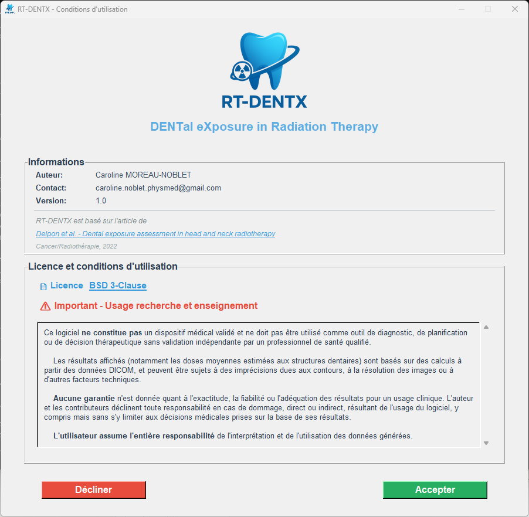
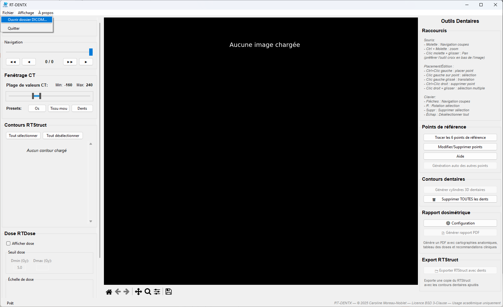
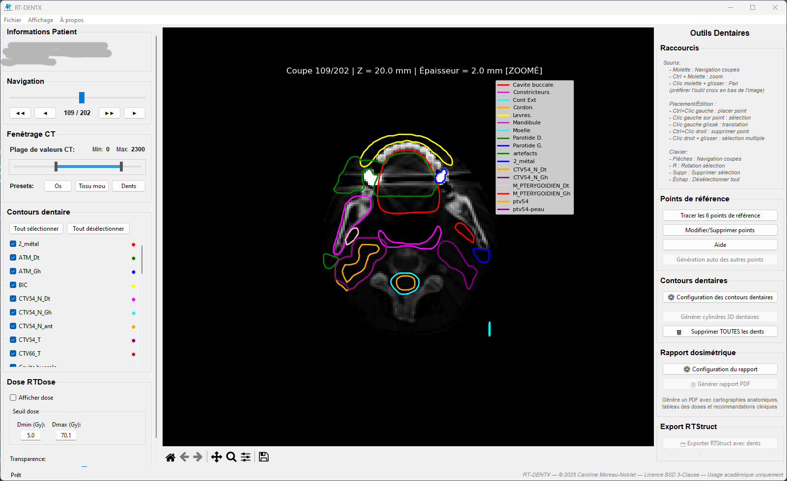
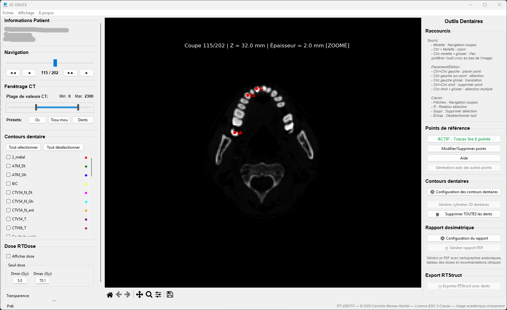
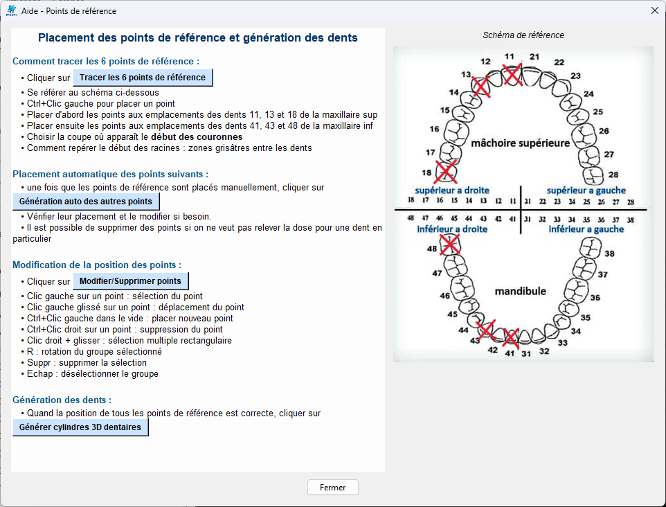
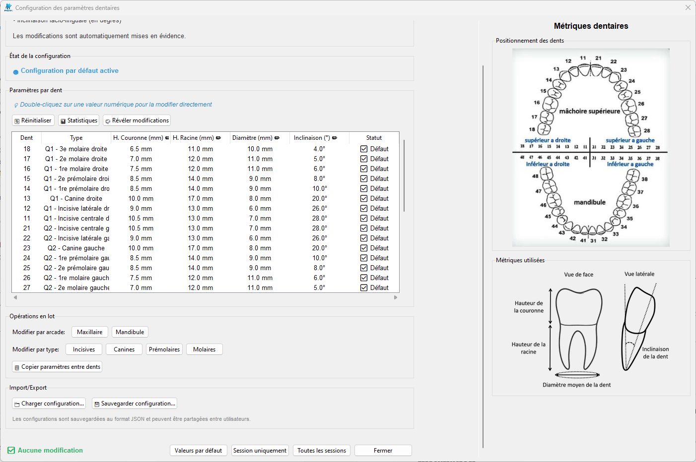
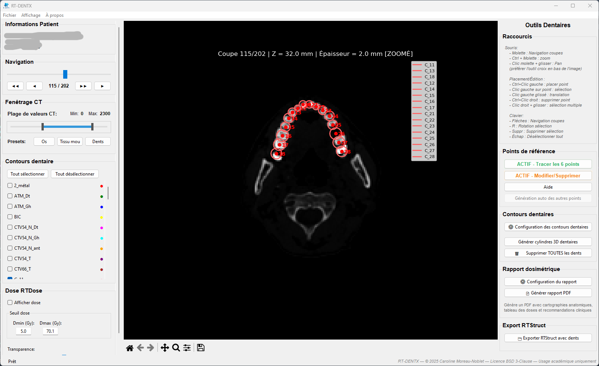
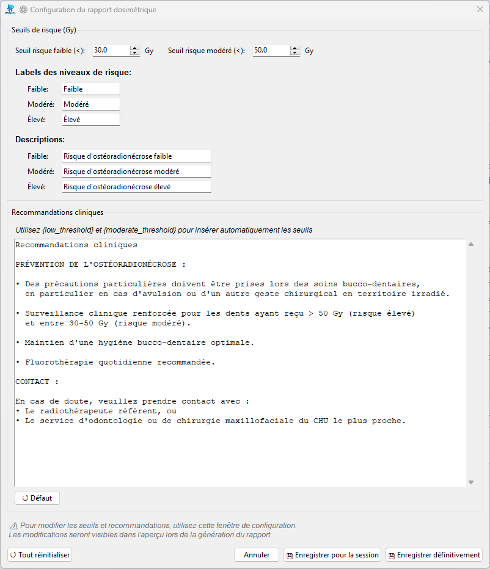
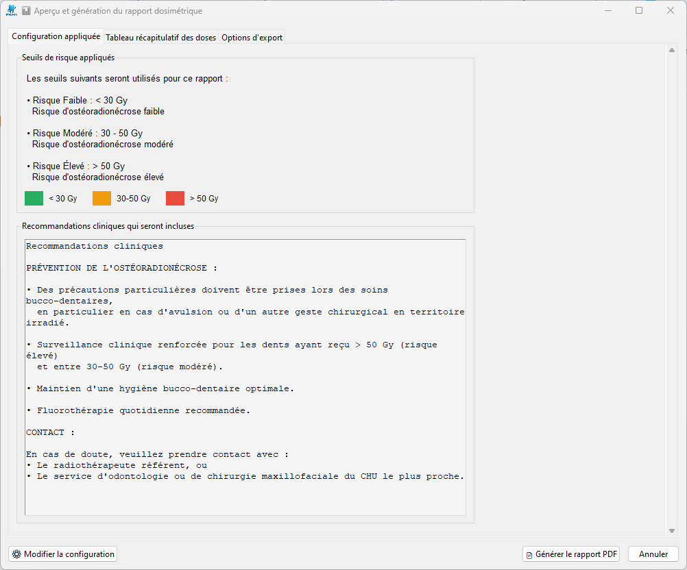
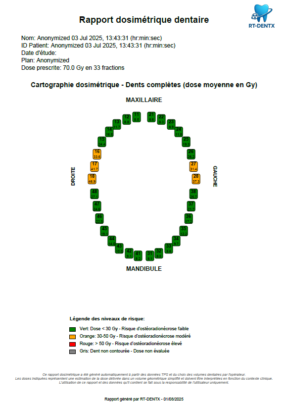

#  - Manuel Utilisateur

## Table des matières

1. [Introduction](#introduction)
2. [Installation](#installation)
3. [Préparation des données DICOM](#préparation-des-données-dicom)
4. [Démarrage ](#démarrage)
5. [Workflow clinique détaillé](#workflow-clinique-détaillé)
6. [Résolution des problèmes](#résolution-des-problèmes)


---

## Introduction

RT-DENTX est un logiciel médical conçu pour évaluer la dose reçue par les structures dentaires lors de traitements de radiothérapie. Il permet d'identifier les dents à risque d'ostéoradionécrose et de générer des rapports dosimétriques détaillés pour améliorer la prise en charge des patients.

### Cas d'usage principaux

- **Oncologues radiothérapeutes** : Évaluation post-planification des doses dentaires
- **Dentistes spécialisés** : Identification des dents nécessitant une surveillance accrue

---

## Installation

### Windows
<ul style="list-style-type:none;">
  <li>1. Téléchargez `RT-DENTX.exe` depuis la page des releases </li>
  <li>2. Exécutez l'installateur et suivez les instructions</li>
  <li>3. Lancez RT-DENTX depuis le menu Démarrer</li>
</ul>


---

## Préparation des données DICOM

### Organisation requise des fichiers

**IMPORTANT** : Pour un fonctionnement optimal, les fichiers DICOM du patient doivent être organisés comme suit :

<ul style="list-style-type:none;">
  <li>1. **Créez un dossier dédié** pour chaque patient</li>
  <li>2. **Placez tous les fichiers DICOM dans ce même dossier** :
     - Série CT complète (tous les fichiers .dcm du scanner)
     - **UN SEUL** fichier RTDose 
     - **UN SEUL** fichier RTStruct 
     - **UN SEUL** fichier RTPlan si disponible</li>
</ul>


### Structure recommandée :
```
Patient_XXX/
├── CT.1.2.3.4.5.6.7.8.9.1.dcm
├── CT.1.2.3.4.5.6.7.8.9.2.dcm
├── CT.1.2.3.4.5.6.7.8.9.3.dcm
├── ... (tous les fichiers CT)
├── RD.1.2.3.4.5.6.7.8.9.dcm    (RTDose)
├── RS.1.2.3.4.5.6.7.8.9.dcm    (RTStruct)
└── RP.1.2.3.4.5.6.7.8.9.dcm    (RTPlan - optionnel)
```

### ❌ À éviter :
- Plusieurs RTDose dans le même dossier
- Plusieurs RTStruct dans le même dossier
- Fichiers de différents patients mélangés
- Sous-dossiers séparés pour CT/RTDose/RTStruct

---

## Démarrage 

### Lancement



<ul style="list-style-type:none;">
  <li>1. **Acceptez la licence** </li>
  <li>2. **L'interface principale** s'ouvre automatiquement</li>
</ul>


### Chargement des données DICOM

1. **Menu Fichier → Ouvrir dossier DICOM**
   
   

2. **Sélectionnez le dossier** préparé contenant tous les fichiers DICOM

3. **Vérification du chargement** :
   - Message de confirmation pour chaque type de fichier chargé
   - Barre de statut indiquant "CT: ✓ | RTDose: ✓ | RTStruct: ✓"

### Vue principale après chargement



L'interface se compose de :
- **Zone centrale** : Visualisation des coupes CT, des structures du RTStruct et de la distribution de dose (cocher "Afficher dose")
- **Panneau gauche** : Navigation et affichage
- **Panneau droit** : Outils dentaires

---

#### Section "Outils dentaires"

Les boutons doivent être utilisés dans l'ordre suivant :

<ul style="list-style-type:none;">
  <li>1. **📍 Tracer les 6 points de référence**</li>
  <li>2. **✏️ Modifier/Supprimer points** (si correction nécessaire)</li>
  <li>3. **🔄 Génération auto des autres points**</li>
  <li>4. **✏️ Modifier/Supprimer points** (si correction nécessaire)</li>
  <li>5. **🔧 Configuration des contours dentaires**</li>
  <li>6. **🦷 Générer les cylindres 3D dentaires**</li>
  <li>6. **✏️ Modifier/Supprimer points** (si correction nécessaire) et **relancer la génération des cylindres dentaires**</li>
  <li>7. **💾 Optionnel : Exporter RTStruct avec dents**</li>
  <li>8. **📊 Générer rapport PDF**</li>
</ul>

---

## Workflow clinique détaillé

### Étape 1 : Placement des 6 points de référence

#### Activation du mode placement

1. **Cliquez sur "Tracer les 6 points de référence"**
   - Le bouton devient actif (surligné)
   - Crtl + Clic gauche pour placer un point

#### Points à placer

Les 6 points de référence correspondent aux dents suivantes :
- **11** : Incisive centrale supérieure droite
- **13** : Canine supérieure droite  
- **18** : Molaire supérieure droite (dent de sagesse)
- **41** : Incisive centrale inférieure droite
- **43** : Canine inférieure droite
- **48** : Molaire inférieure droite (dent de sagesse)

#### Placement correct des points

**⚠️ IMPORTANT** : Les points doivent être placés **à la base des couronnes**, c'est-à-dire à la jonction entre la couronne et la racine (collet anatomique).



**Conseils pour un placement optimal :**
- Naviguez jusqu'à une coupe où les dents sont bien visibles
- Utilisez la coupe à la base des couronnes dentaires
- En cas de doute, consultez la section Aide du logiciel (bouton Aide)



#### Placement des points

1. **Cliquez sur la dent 11** à la base de la couronne
   - Un marqueur rouge apparaît avec le label "11"
2. **Répétez pour les dents 13, 18, 41, 43 et 48**


### Étape 2 : Modification des points (si nécessaire)

Si vous devez corriger la position d'un point :

<ul style="list-style-type:none;">
  <li>1. **Cliquez sur "Modifier/Supprimer points"**</li>
  <li>2. **Pour déplacer** : Cliquez et glissez le point</li>
  <li>3. **Pour supprimer** : Clic droit sur le point</li>
  <li>4. **Pour sélectionner plusieurs points** : Clic droit glissé pour former un rectangle de sélection</li>
  <li>5. **Pour faire une rotation d'un groupe de points sélectionnés** : appuyer sur R et entrer la valeur de la rotation en degrés</li>
  <li>6. **Désactivez le mode** en recliquant sur le bouton</li>
</ul>


### Étape 3 : Génération automatique des autres points

1. **Cliquez sur "Génération auto des autres points"**
   - Le logiciel place automatiquement les autres dents
   - Basé sur l'anatomie standard et les 6 points de référence

2. **Vérifiez les points générés**
   - 32 points au total doivent être visibles
   - Chaque dent est identifiée par son numéro

3. **Si correction nécessaire** :
   - Activez "Modifier/Supprimer points"
   - Ajustez les positions incorrectes
   - Désactivez le mode modification

### Étape 4 : Configuration des paramètres (optionnel)

 
 
Avant de générer les cylindres, vous pouvez ajuster les paramètres :

1. **Cliquez sur "Configuration des contours dentaires"**

2. **Paramètres ajustables** :
   - **Hauteur couronne** : 5-20 mm (défaut : 11 mm)
   - **Hauteur racine** : 8-25 mm (défaut : variable selon la dent)
   - **Diamètre** : 3-15 mm (défaut : variable selon la dent)
   - **Inclinaison** : -45° à +45° (défaut : 0°)

3. **Modification individuelle** :
   - Double-clic pour modifier une valeur du tableau

### Étape 5 : Génération des cylindres 3D

1. **Cliquez sur "Générer les cylindres 3D dentaires"**
   - Génération automatique des structures cylindriques
   - Couronne en bleu, racine en rouge

2. **Vérification visuelle** :
   - Naviguez dans les coupes pour vérifier le positionnement
   - Si le positionnement est incorrect, il est possible de modifier la position du point correspondant et de regénérer les cylindres. 



### Étape 6 : Export des structures (optionnel)

Pour ajouter les structures dentaires au RTStruct du patient :

 **Cliquez sur "Exporter RTStruct avec dents"**


### Étape 7 : Génération du rapport dosimétrique



1. **Configuration du rapport** 
Les recommandations cliniques et les seuils de risque peuvent être modifiés. 



2. **Cliquez sur "Générer rapport PDF"**
   - ✅ **Cartographies anatomiques** : Représentation visuelle avec code couleur
   - ✅ **Tableau récapitulatif des doses** : Données détaillées par structure
   - ✅ **Recommandations cliniques** : Conseils personnalisés selon les doses
   - Vous pouvez choisir d'inclure :
       - **Dose complète** : Dose moyenne sur toute la dent
       - **Dose couronne** : Dose moyenne dans la couronne uniquement
       - **Dose racine** : Dose moyenne dans la racine uniquement


### Contenu du rapport généré



Le rapport PDF contient :

1. **Page de garde** avec :
   - Informations patient
   - Informations sur le plan (si disponible)

2. **Cartographies visuelles** (si sélectionnées) :
   - Vue maxillaire (mâchoire supérieure)
   - Vue mandibulaire (mâchoire inférieure)
   - Code couleur selon les seuils de risque configurés

3. **Tableau détaillé** (si sélectionné) :
   - Doses moyennes par dent
   - Niveau de risque

4. **Recommandations cliniques** (si sélectionnées) 

---


---

## Résolution des problèmes

### Problèmes de chargement

#### "Plusieurs RTDose trouvés"

**Solution** : 
- Assurez-vous qu'il n'y a qu'UN SEUL fichier RTDose dans le dossier
- Déplacez les autres RTDose dans un dossier séparé

#### "Aucun point de référence placé"

**Solution** :
- Vérifiez que vous avez bien placé les 6 points requis

### Problèmes de génération

#### "Impossible de générer les cylindres"

**Vérifications** :
- Les 6 points de référence sont placés
- La génération automatique des autres points a été effectuée

#### "Doses non calculées"

**Causes possibles** :
- RTDose non chargé correctement
- Cylindres non générés
- Problème de correspondance spatiale

### Problèmes d'export

#### "Export RTStruct échoué"

**Solutions** :
- Vérifiez l'espace disque disponible
- Assurez-vous d'avoir les droits d'écriture
- Essayez un nom de fichier sans caractères spéciaux
- Header dicom du RTStruct d'origine qui ne respecte pas les normes dicom standard


---


**RT-DENTX** - © 2025 Caroline Moreau-Noblet - Licence BSD 3-Clause
